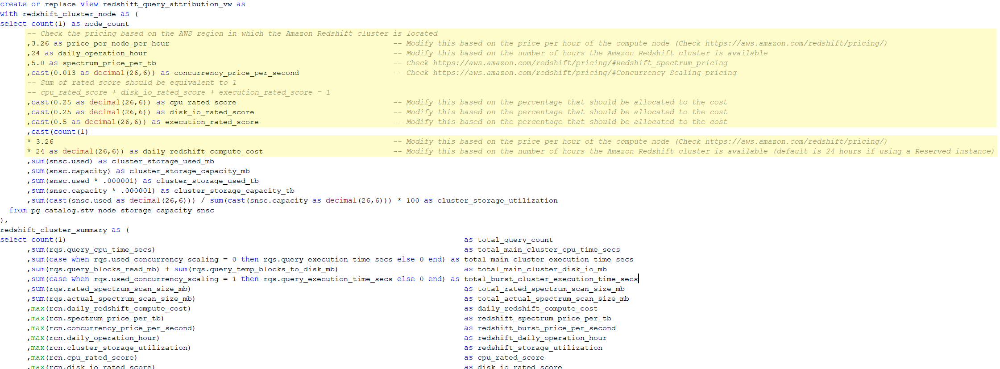

## Amazon Redshift Cost Attribution

In this repo, there are three views you can reference on how to attribute the cost of a query in [Amazon Redshift](https://aws.amazon.com/redshift/).

• [redshift_spectrum_scan_summary_vw](source/redshift_views/redshift_spectrum_scan_summary_vw.sql) - Contains information about the Amazon Redshift Spectrum query

• [redshift_query_summary_vw](source/redshift_views/redshift_query_summary_vw.sql) - Contains information about a query execution at the query level

• [redshift_query_attribution_vw](source/redshift_views/redshift_query_attribution_vw.sql) - Contains information about the estimated compute cost (in USD) of each query execution

# Pre-requisites
When you download the views, as a pre-requisite before using is to modify the [redshift_query_attribution_vw](source/redshift_views/redshift_query_attribution_vw.sql) script.
Update the values as per the following based on your Amazon Redshift cluster configuration:

• price_per_node_per_hour

• daily_operation_hour

• spectrum_price_per_tb

• concurrency_price_per_second

• cpu_rated_score 

• disk_io_rated_score

• execution_rated_score

• daily_redshift_compute_cost

## Security

See [CONTRIBUTING](CONTRIBUTING.md#security-issue-notifications) for more information.

## License

This library is licensed under the MIT-0 License. See the LICENSE file.

